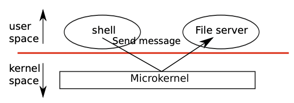

- [운영체제 구조](./chapter_1.md)
  - [물리적 리소스 추상화](./chapter_1-1.md)
  - [유저모드, 커널모드 그리고 시스템콜](./chatper_1-2.md)
  - [커널 구조 (this page)](./chapter_1-3.md)
  - [프로세스 개요](./chapter_1-4.md)
  - [코드: 첫 번째 주소 공간](./chapter_1-5.md)
  - [코드: 첫 번째 프로세스 생성](./chapter_1-6.md)
  - [코드: 첫 번째 프로세스 실행](./chapter_1-7.md)
  - [코드: 첫 번째 시스템콜 - exec](./chapter_1-8.md)
  - [현실 세계에서](./chapter_1-9.md)
  - [연습문제](./chapter_1-10.md)
  
# Kernel organization

A key design question is what part of the operating system should run in kernel mode. One possibility is that the entire operating system resides in the kernel, so that the implementations of all system calls run in kernel mode. This organization is called a monolithic kernel.

핵심적인 설계 질문 중 하나는 운영체제의 어떤 부분이 커널 모드에서 실행되어야 하는지입니다. 한 가지 가능성은 전체 운영체제가 커널 내에 존재하여 모든 시스템 콜의 구현이 커널 모드에서 실행되도록 하는 것입니다. 이러한 구조를 모놀리식 커널(monolithic kernel)이라고 합니다.

In this organization the entire operating system runs with full hardware privilege. This organization is convenient because the OS designer doesn’t have to decide which part of the operating system doesn’t need full hardware privilege. Furthermore, it easy for different parts of the operating system to cooperate. For example, an operating system might have a buffer cache that can be shared both by the file system and the virtual memory system.

이 구조에서는 전체 운영체제가 전체 하드웨어 권한으로 실행됩니다. 이 구조는 운영체제 설계자가 어떤 부분이 전체 하드웨어 권한이 필요하지 않은지 결정할 필요가 없어 편리합니다. 또한 운영체제의 다른 부분이 쉽게 협력할 수 있습니다. 예를 들어, 운영체제는 파일 시스템과 가상 메모리 시스템 모두에서 공유할 수 있는 버퍼 캐시를 가질 수 있습니다.

A downside of the monolithic organization is that the interfaces between different parts of the operating system are often complex (as we will see in the rest of this text), and therefore it is easy for an operating system developer to make a mistake. In a monolithic kernel, a mistake is fatal, because an error in kernel mode will often result in the kernel to fail. If the kernel fails, the computer stops working, and thus all applications fail too. The computer must reboot to start again.

모놀리식 커널 구조의 단점은 운영체제의 다른 부분 간의 인터페이스가 종종 복잡하다는 것입니다(텍스트의 나머지 부분에서 볼 것입니다). 따라서 운영체제 개발자가 실수하기 쉽습니다. 모놀리식 커널에서 실수는 치명적일 수 있습니다. 왜냐하면 커널 모드에서의 오류는 종종 커널이 실패하게 만듭니다. 커널이 실패하면 컴퓨터가 작동을 중지하며, 따라서 모든 응용 프로그램도 실패합니다. 컴퓨터는 재부팅해야 다시 시작할 수 있습니다.

To reduce the risk of mistakes in the kernel, OS designers can minimize the amount of operating system code that runs in kernel mode, and execute the bulk of the operating system in user mode. This kernel organization is called a microkernel.

커널 내에서의 실수 위험을 줄이기 위해 운영체제 설계자는 커널 모드에서 실행되는 운영체제 코드의 양을 최소화하고 운영체제의 대부분을 사용자 모드에서 실행할 수 있도록 할 수 있습니다. 이러한 커널 구성을 마이크로커널(microkernel)이라고 합니다.

Figure 1-1 illustrates this microkernel design. In the figure, the file system runs as a user-level process. OS services running as processes are called servers. To allow applications to interact with the file server, the kernel provides an inter-process communication mechanism to send messages from one user-mode process to another. For example, if an application like the shell wants to read or write a file, it sends a message to the file server and waits for a response.

Figure 1-1은 이 마이크로커널 디자인을 설명합니다. 이 그림에서 파일 시스템은 사용자 수준 프로세스로 실행됩니다. 프로세스로 실행되는 운영체제 서비스를 서버라고 합니다. 응용 프로그램이 파일 서버와 상호 작용할 수 있도록 하기 위해 커널은 한 사용자 모드 프로세스에서 다른 사용자 모드 프로세스로 메시지를 보내는 프로세스 간 통신 메커니즘을 제공합니다. 예를 들어, 셸과 같은 응용 프로그램이 파일을 읽거나 쓰려면, 파일 서버에게 메시지를 보내고 응답을 기다립니다.

In a microkernel, the kernel interface consists of a few low-level functions for starting applications, sending messages, accessing device hardware, etc. This organization allows the kernel to be relatively simple, as most of the operating system resides in user-level servers.

마이크로커널에서 커널 인터페이스는 응용 프로그램을 시작하는데 필요한 몇 가지 저수준 함수, 메시지를 보내는 함수, 장치 하드웨어에 접근하는 함수 등으로 구성됩니다. 이 구성은 커널을 비교적 간단하게 유지할 수 있게 해주며, 대부분의 운영체제 기능이 사용자 수준 서버에 위치하게 됩니다.

Xv6 is implemented as a monolithic kernel, following most Unix operating systems. Thus, in xv6, the kernel interface corresponds to the operating system interface, and the kernel implements the complete operating system. Since xv6 doesn’t provide many services, its kernel is smaller than some microkernels.

xv6는 대부분의 유닉스 운영체제와 같이 모놀리식 커널(monolithic kernel)로 구현되었습니다. 따라서 xv6에서 커널 인터페이스는 운영체제 인터페이스에 해당하며, 커널은 완전한 운영체제를 구현합니다. xv6는 많은 서비스를 제공하지 않기 때문에 마이크로커널들보다 커널이 작습니다.
