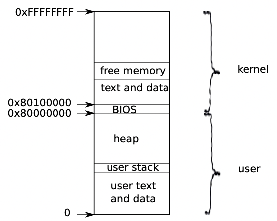
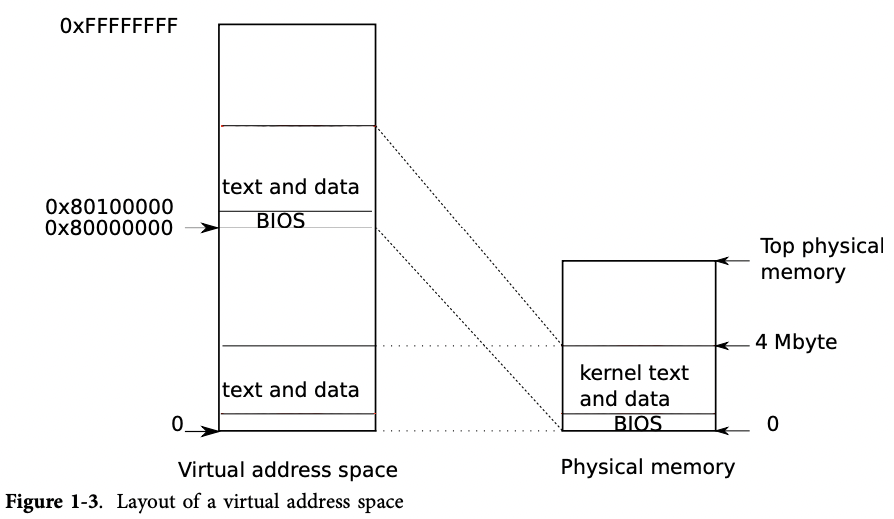

- [운영체제 구조](./chapter_1.md)
    - [물리적 리소스 추상화](./chapter_1-1.md)
    - [유저모드, 커널모드 그리고 시스템콜](./chatper_1-2.md)
    - [커널 구조](./chapter_1-3.md)
    - [프로세스 개요 (this page)](./chapter_1-4.md)
    - [코드: 첫 번째 주소 공간](./chapter_1-5.md)
    - [코드: 첫 번째 프로세스 생성](./chapter_1-6.md)
    - [코드: 첫 번째 프로세스 실행](./chapter_1-7.md)
    - [코드: 첫 번째 시스템콜 - exec](./chapter_1-8.md)
    - [현실 세계에서](./chapter_1-9.md)
    - [연습문제](./chapter_1-10.md)

# Process overview

The unit of isolation in xv6 (as in other Unix operating systems) is a process. The process abstraction prevents one process from wrecking or spying on another process’s memory, CPU, file descriptors, etc. It also prevents a process from wrecking the kernel itself, so that a process can’t subvert the kernel’s isolation mechanisms. The kernel must implement the process abstraction with care because a buggy or malicious application may trick the kernel or hardware in doing something bad (e.g., circumventing enforced isolation). The mechanisms used by the kernel to implement processes include the user/kernel mode flag, address spaces, and time-slicing of threads.

xv6(그리고 다른 유닉스 운영 체제들)에서 격리의 단위는 프로세스입니다. 프로세스 추상화는 한 프로세스가 다른 프로세스의 메모리, CPU, 파일 디스크립터 등을 파괴하거나 감시하지 못하도록 방지합니다. 또한 프로세스가 커널 자체를 파괴하지 못하도록 하여 프로세스가 커널의 격리 메커니즘을 훼손하지 못하도록 합니다. 커널은 프로세스 추상화를 신중하게 구현해야 합니다. 왜냐하면 버그가 있는 애플리케이션이나 악의적인 애플리케이션이 커널이나 하드웨어를 속여서 나쁜 작업(예: 격리 회피)을 수행할 수 있기 때문입니다. 커널이 프로세스를 구현하는 데 사용하는 메커니즘에는 사용자/커널 모드 플래그, 주소 공간, 스레드의 시간 분할 등이 포함됩니다.

To help enforce isolation, the process abstraction provides the illusion to a program that it has its own private machine. A process provides a program with what appears to be a private memory system, or address space, which other processes cannot read or write. A process also provides the program with what appears to be its own CPU to execute the program’s instructions.

격리를 강화하기 위해 프로세스 추상화는 프로그램에게 자신만의 고유한 기계가 있는 것처럼 보이도록 합니다. 프로세스는 프로그램에 고유의 메모리 시스템 또는 주소 공간을 제공하여 다른 프로세스가 읽거나 쓸 수 없도록 합니다. 또한 프로세스는 프로그램에게 자신의 명령을 실행할 CPU도 제공하는 것처럼 보입니다.

Xv6 uses page tables (which are implemented by hardware) to give each process its own address space. The x86 page table translates (or `maps`) a virtual address (the address that an x86 instruction manipulates) to a physical address (an address that the processor chip sends to main memory).

xv6는 각 프로세스에 고유한 주소 공간을 제공하기 위해 페이지 테이블을 사용합니다. x86 페이지 테이블은 가상 주소(명령어가 조작하는 주소)를 물리 주소(프로세서 칩이 주 메모리로 보내는 주소)로 변환(또는 매핑)합니다. 이 페이지 테이블은 하드웨어에 의해 구현되며 각 프로세스에게 독립된 가상 주소 공간을 제공하는 역할을 합니다.

Xv6 maintains a separate page table for each process that defines that process’s address space. As illustrated in Figure 1-2, an address space includes the process’s user memory starting at virtual address zero. Instructions come first, followed by global variables, then the stack, and finally a `heap` area (for malloc) that the process can expand as needed.

xv6는 각 프로세스마다 해당 프로세스의 주소 공간을 정의하는 별도의 페이지 테이블을 유지합니다. Figure 1-2에서 나타나듯이, 주소 공간에는 가상 주소 0에서 시작하는 프로세스의 사용자 메모리가 포함됩니다. 명령어가 먼저 나오며, 이어서 전역 변수, 스택, 그리고 프로세스가 필요에 따라 확장할 수 있는 힙 영역(malloc을 위한)이 나옵니다.

Each process’s address space maps the kernel’s instructions and data as well as the user program’s memory. When a process invokes a system call, the system call executes in the kernel mappings of the process’s address space. This arrangement exists so that the kernel’s system call code can directly refer to user memory. In order to leave plenty of room for user memory, xv6’s address spaces map the kernel at high addresses, starting at 0x80100000.

각 프로세스의 주소 공간은 커널의 명령어와 데이터뿐만 아니라 사용자 프로그램의 메모리도 매핑합니다. 프로세스가 시스템 콜을 호출하면 시스템 콜은 프로세스 주소 공간의 커널 매핑에서 실행됩니다. 이러한 구조는 커널의 시스템 콜 코드가 직접적으로 사용자 메모리를 참조할 수 있도록 하기 위해 존재합니다. 사용자 메모리에 충분한 공간을 확보하기 위해 xv6의 주소 공간은 커널을 높은 주소에 매핑하며, 0x80100000에서 시작합니다.

The xv6 kernel maintains many pieces of state for each process, which it gathers into a struct proc (2337). A process’s most important pieces of kernel state are its page table, its kernel stack, and its run state. We’ll use the notation `p->xxx` to refer to elements of the proc structure.

xv6 커널은 각 프로세스마다 여러 가지 상태 정보를 유지하며, 이 정보들은 struct proc (2337)에 모아집니다. 프로세스의 가장 중요한 커널 상태 정보는 페이지 테이블, 커널 스택 및 실행 상태입니다. 우리는 proc 구조체의 요소에 접근할 때 `p->xxx` 표기법을 사용할 것입니다.

Each process has a thread of execution (or thread for short) that executes the process’s instructions. A thread can be suspended and later resumed. To switch transparently between processes, the kernel suspends the currently running thread and resumes another process’s thread. Much of the state of a thread (local variables, function call return addresses) is stored on the thread’s stacks. Each process has two stacks: a user stack and a kernel stack (p->kstack). When the process is executing user instructions, only its user stack is in use, and its kernel stack is empty. When the process enters the kernel (for a system call or interrupt), the kernel code executes on the process’s kernel stack; while a process is in the kernel, its user stack still contains saved data, but isn’t actively used. A process’s thread alternates between actively using its user stack and its kernel stack. The kernel stack is separate (and protected from user code) so that the kernel can execute even if a process has wrecked its user stack.

각 프로세스는 프로세스의 명령어를 실행하는 실행 스레드(스레드로 줄여 부릅니다)를 갖습니다. 스레드는 중단되고 나중에 다시 시작될 수 있습니다. 프로세스 간에 투명하게 전환하기 위해 커널은 현재 실행 중인 스레드를 중단하고 다른 프로세스의 스레드를 재개합니다. 스레드의 많은 상태(로컬 변수, 함수 호출 반환 주소 등)는 스레드의 스택에 저장됩니다. 각 프로세스는 사용자 스택과 커널 스택(p->kstack) 두 개의 스택을 가지고 있습니다. 프로세스가 사용자 명령어를 실행할 때는 사용자 스택만 사용하고 커널 스택은 비어 있습니다. 프로세스가 커널로 진입할 때(시스템 콜이나 인터럽트 처리 시), 커널 코드는 프로세스의 커널 스택에서 실행됩니다. 프로세스가 커널 내에 있을 때 사용자 스택에는 여전히 저장된 데이터가 있지만 실제로는 사용되지 않습니다. 프로세스의 스레드는 사용자 스택과 커널 스택을 번갈아가며 사용합니다. 커널 스택은 별도로 유지되며(사용자 코드로부터 보호됨), 프로세스가 사용자 스택을 파괴하더라도 커널이 실행될 수 있습니다.

When a process makes a system call, the processor switches to the kernel stack, raises the hardware privilege level, and starts executing the kernel instructions that implement the system call. When the system call completes, the kernel returns to user space: the hardware lowers its privilege level, switches back to the user stack, and resumes executing user instructions just after the system call instruction. A process’s thread can ‘‘block’’ in the kernel to wait for I/O, and resume where it left off when the I/O has finished.

프로세스가 시스템 콜을 수행하면 프로세서는 커널 스택으로 전환되고, 하드웨어 권한 레벨이 올라가며 시스템 콜을 구현하는 커널 명령어를 실행합니다. 시스템 콜이 완료되면 커널은 사용자 공간으로 돌아갑니다. 하드웨어는 권한 레벨을 낮추고 사용자 스택으로 전환하며, 시스템 콜 명령어 다음에 있는 사용자 명령을 계속 실행합니다. 프로세스의 스레드는 I/O를 기다리기 위해 커널에서 '차단'될 수 있으며, I/O가 완료되면 이전 위치에서 다시 시작됩니다.

`p->state` indicates whether the process is allocated, ready to run, running, waiting for I/O, or exiting. `p->pgdir` holds the process’s page table, in the format that the x86 hardware expects. xv6 causes the paging hardware to use a process’s p->pgdir when executing that process. A process’s page table also serves as the record of the addresses of the physical pages allocated to store the process’s memory.

`p->state`는 프로세스가 할당된 상태인지, 실행 준비가 된 상태인지, 실행 중인 상태인지, I/O를 기다리는 상태인지, 또는 종료 상태인지를 나타냅니다. `p->pgdir`는 프로세스의 페이지 테이블을 x86 하드웨어가 예상하는 형식으로 보유합니다. xv6는 프로세스를 실행할 때 해당 프로세스의 p->pgdir을 사용하도록 페이징 하드웨어를 설정합니다. 프로세스의 페이지 테이블은 또한 프로세스의 메모리를 저장하기 위해 할당된 물리적 페이지의 주소를 기록하는 역할도 합니다.